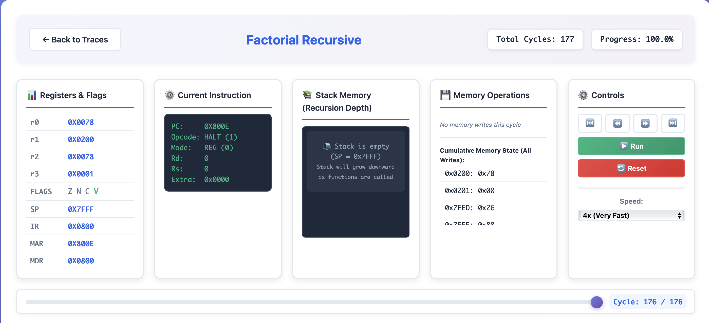
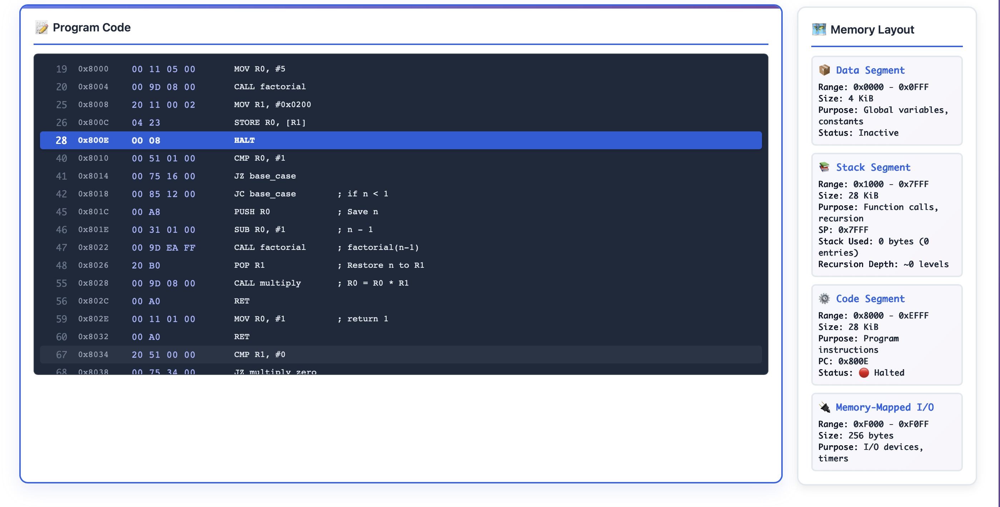

# Software CPU Simulator

A complete **16-bit CPU simulator** with assembler, emulator, and interactive web-based trace viewer. This project demonstrates how a CPU operates internally through fetch-decode-execute cycles, memory management, function calls, recursion, and I/O operations.

## Features

- **Complete ISA Implementation** - 25 instructions with 6 addressing modes
- **Full Assembler** - Converts assembly code to machine code
- **CPU Emulator** - Simulates 16-bit processor with registers, ALU, and memory
- **Function Calls & Recursion** - Full support for stack frames and recursive functions
- **Interactive Trace Viewer** - Web-based visualization of CPU execution with real-time stack tracking
- **Comprehensive Testing** - Unit tests and integration tests
- **Example Programs** - Hello World, Fibonacci, Factorial (recursive), and more
- **Debug Tools** - Step-by-step execution and memory inspection

## Quick Start Demo

**One-command demo for new users:**
**Note: All commands are for Mac/Linux**
```bash
# Clone the repository
git clone <https://github.com/JNR-10/software-cpu>
cd software-cpu

# Download these dependencies
# WSL:
  sudo apt-get install -y jq
  sudo apt-get install -y dos2unix
# Mac:
  brew install jq 
  brew install dos2unix

# Run the complete interactive demo
chmod +x demo.sh
dos2unix ./scripts/*.sh
dos2unix ./demo.sh
./demo.sh
```

This will:
1. Build the entire project
2. Run unit tests
3. Generate execution traces for multiple programs including factorial recursion
4. Launch the interactive web-based trace viewer
5. Open your browser automatically to visualize CPU execution

## Architecture Overview

### CPU Components
- **16-bit Architecture** with 4 general-purpose registers (R0-R3)
- **ALU** supporting arithmetic, logical, and shift operations
- **Memory Management** with 64KB address space
- **Stack Operations** with dedicated stack pointer
- **Memory-Mapped I/O** for device communication
- **Flag Register** (Zero, Negative, Carry, Overflow)

### Instruction Set
- **25 Instructions**: NOP, HALT, MOV, LOAD, STORE, ADD, SUB, AND, OR, XOR, CMP, SHL, SHR, JMP, JZ, JNZ, JC, JNC, JN, CALL, RET, PUSH, POP, IN, OUT
- **6 Addressing Modes**: Register, Immediate, Direct, Register Indirect, Register+Offset, PC-Relative
- **Complete Control Flow**: Conditional jumps, subroutine calls, stack operations

### Memory Layout

```
Address Range      Description
-----------------  -------------------------------------------
0x0000–0x0FFF      Data Segment (4 KiB) – global variables
0x1000–0x7FFF      Stack Segment (28 KiB) – grows downward
0x8000–0xEFFF      Code Segment (28 KiB) – program code
0xF000–0xF0FF      Memory-mapped I/O (256 bytes)
0xF100–0xFFFF      Reserved (vectors, ROM)
```

### Calling Convention

**Register Roles:**
- **R0**: First argument / Return value
- **R1**: Second argument / Temporary
- **R2**: Third argument / Temporary
- **R3**: Frame Pointer (FP) - Callee-saved

**Stack Frame:**
```
Higher Addresses
┌─────────────────────────┐
│   Return Address (PC)   │  ← Pushed by CALL
├─────────────────────────┤
│   Saved Registers       │  ← PUSH/POP
├─────────────────────────┤
│   Local Variables       │
└─────────────────────────┘  ← Current SP
Lower Addresses
```

## Project Structure

```
software-cpu/
├──  demo.sh                    # One-command demo script
├──  README.md                  # This file
├──  Makefile                   # Build system
│
├──  docs/                      # Documentation
│   ├── ISA.md                   # Instruction Set Architecture
│   ├── memory_map.md            # Memory layout
│   └── phase*.md                # Development phases
│
├── src/                       # Source code
│   ├── main.cpp                 # Main application
│   ├── assembler/               # Assembly → Machine code
│   ├── emulator/                # CPU simulation engine
│   └── programs/                # Example assembly programs
│
├── tests/                     # Test suites
│   └── assembly/                # Assembly test programs
│
├── trace_viewer/              # Web-based trace visualization
│   ├── index.html               # Trace viewer interface
│   ├── script.js                # Visualization logic
│   └── style.css                # Styling
│
├── scripts/                   # Utility scripts
└── build/                     # Build artifacts and traces
```

## Usage Examples

### Libraries/Dependencies Needed
```bash
sudo apt-get install -y jq
sudo apt-get install -y dos2unix
```

### Basic Operations

```bash
# Build everything
make all

# Run unit tests
make test

# Assemble a program
dos2unix ./bin/software-cpu assemble src/programs/fibonacci.asm build/fib.bin
./bin/software-cpu assemble src/programs/fibonacci.asm build/fib.bin

# Run a program
dos2unix ./bin/software-cpu run build/fib.bin
./bin/software-cpu run build/fib.bin

# Interactive debugging
dos2unix ./bin/software-cpu debug build/fib.bin
./bin/software-cpu debug build/fib.bin
```

## Example Programs

| Program | Description | Demonstrates |
|---------|-------------|--------------|
| `hello_world.asm` | Simple HALT instruction | Basic program structure |
| `fibonacci.asm` | Fibonacci sequence calculation | Loops, arithmetic, memory |
| `factorial.asm` | Recursive factorial function | Function calls, recursion, stack frames |
| `math.asm` | Multiplication using shift-and-add | Algorithm implementation |
| `timer_example.asm` | Timer functionality | Memory-mapped I/O |

### Factorial (Recursive)
- **File**: `src/programs/factorial.asm`
- **Features**: Recursive implementation with stack frames
- **Test Cases**: factorial(5) = 120, factorial(10) = 3628800
- **Trace**: Shows complete recursion depth and stack evolution

### Factorial(5) Execution
```
factorial(5) = 5 * factorial(4)
             = 5 * 4 * factorial(3)
             = 5 * 4 * 3 * factorial(2)
             = 5 * 4 * 3 * 2 * factorial(1)
             = 5 * 4 * 3 * 2 * 1
             = 120
```

### Stack Evolution
```
Initial:     SP = 0x7FFF
Call f(5):   SP = 0x7FFD (return addr), 0x7FFB (saved n=5)
Call f(4):   SP = 0x7FF9 (return addr), 0x7FF7 (saved n=4)
Call f(3):   SP = 0x7FF5 (return addr), 0x7FF3 (saved n=3)
Call f(2):   SP = 0x7FF1 (return addr), 0x7FEF (saved n=2)
Call f(1):   SP = 0x7FED (return addr) → Returns 1
Unwind...    SP returns to 0x7FFF
Result:      R0 = 120 
```

## Interactive Trace Viewer

The web-based trace viewer provides real-time visualization of CPU execution:

1. **Registers & Flags** - Shows all register values and status flags in real-time
2. **Current Instruction** - Displays the executing instruction with decoding
3. **Stack Memory** - Visualizes recursion depth and stack growth
4. **Memory Operations** - Tracks all memory reads/writes with patterns
5. **Controls** - Playback controls with variable speed
6. **Program Code** - Syntax-highlighted assembly with active line tracking
7. **Cycle Bar** - Progress slider for navigation through execution
8. **Memory Layout** - Shows all 4 memory segments with live status

### Using the Trace Viewer
1. Run the demo.sh file
2. Auto starts the webserver
3. Select which program to trace
4. Use the slider to step through execution cycles
5. Watch registers, stack, and instructions change in real-time

## Development

### Build Requirements
- **C++17** compatible compiler (g++, clang++)
- **Make** build system
- **Python 3** (for trace viewer web server)

### Build Commands
```bash
make all          # Build everything
make test         # Build and run tests
make clean        # Clean build artifacts
```
## Live Project Demo (Google Drive)

Due to the large file size, the demo videos have been shared via Google Drive:

- **Complete Project Demo**: https://drive.google.com/drive/folders/1WXGD3DoWew3UzMFoogyRmkAdpkCSQswJ?usp=share_link
- **Recursive Program Demo**: https://drive.google.com/file/d/1NMPQEUwPOpoAF20DEVWsYW85T0YgU13j/view

## Screenshots : 

